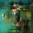

## GENERATED KPOP ALBUM ART
DSC160 Data Science and the Arts - Final Project - Generative Arts - Spring 2020

Project Team Members: 
- Brian Qian - brqian@ucsd.edu 

- Emma Logomasini - elogomas@ucsd.edu 

- Nicholas Kho - nikho@ucsd.edu 

## Abstract

In our Midterm project, our team looked at important songs of each era as outlined in the Sogang University's Professor Huikyong Pang’s class “The Mediums of Korean Cultural Modernity.” We attempted to analyze political periods in association with music trends; however, our analysis was limited by the size of our dataset and our choices in analytical techniques. We are still interested in music over time in Korea, but instead this project will be focusing on the visual aspect of korean music specifically the album art. 

Since K-pop music albums are often strongly associated with its visual branding and concept, we believe it would be interesting to look at album covers from top K-pop albums to new generate concepts with (to clarify, the definition we are using for “K-pop” refers to Korean “idol music” as opposed to all Korean pop songs). For this dataset, we plan on using the Gaon Album Chart data to find the top-selling albums for the 2010s. 

Our first exploration will be a focused on generating album art based on the top selling albums of recent korean history. We then want to explore different datasets of album art from popular boy groups, girl groups, and their icons/logos, to see the contrasting or similar aspects of each demographic. Finally we will scrap random kpop album art from Google and Bing to have a more generalized and larger dataset to generate album art from, also to see how different general kpop album covers are from popular kpop albums. In short, our project will provide greater insight into visual aspects of what makes a popular korean album in conjunction with specific categories like girl groups and boy groups.

To achieve all of this, our technical process will include the use of jupyterhub while utilizing numerous libraries including TensorFlow, Pillow, Keras, and scikit-learn to recreate a deep covolutional generative adversarial network (DC-GAN) that will help us process new album art and display our results in jpg format. 

## Data and Model

Our main training data is from the Gaon Album Chart, Korea’s national music chart, and every year since 2010 they provide a top 10 list of the best-selling albums in Korea of the entire year. Gaon’s ranking process revolves around compiling domestic shipments in weekly, monthly, and year-end formats to which we will utilize their year-end charts. The album cover images will be collected and downloaded from Melon, Korea's top streaming service, to have accurate digital images of the respective albums in their native country. [Link to Gaon Album Chart Data](https://en.wikipedia.org/wiki/Gaon_Album_Chart)

Since our main dataset is limited by the size of around 100 popular covers, for additional exploration purposes we will also collect a different generalized/larger dataset by scrapping random kpop album art from Google and Bing to further generate new album covers from. To achieve this, we will be utilizing the icrawler python library and input english and korean keywords such as ‘kpop album art’ to download around 400 random covers. [Link to icrawler library](https://developer.aliyun.com/mirror/npm/package/icrawler).

Our generative adversarial model is based on MLWhiz’s DC-GAN architecture to which they generated new anime characters from. The idea behind the GAN originated from the paper, [“Unsupervised Representation Learning With Deep Convolutional Generative Adversarial Network”](https://arxiv.org/pdf/1511.06434.pdf) by Alex Radford, Luke Metz, and Soumith, where they discussed how the to implement a more stable training implementation through a generator architecture to which creates fakes. The discriminator on the other hand contains a multitude of convolutional layers in conjunction with a dense layer to predict if a given image is fake or not. The model provided a basis for our exploration and generative process. [Link to MLWhiz](https://mlwhiz.com/blog/2019/06/17/gans/).

## Code

[Scrapping Code File](code/scrapper.ipynb)

For the data acquisition portion of our code, we first utilized crawlers built in libraries and imported GoogleImageCrawler and BingImageCrawler. We further utilized those function in conjunction with specific keywords in both english and korean like '한국 앨범 표지' which translates to 'Korean Album Cover,' to download a set of over 400 images. We ran the code twice as a few images were not particularly album covers to which we hand deleted them.

[Preprocessing & Neural Network Code File](code/network.ipynb)

For the analysis portion of our code, we first had to preprocess the given datasets and normalize the aspect ratio and resolution size to be balanced among every album image. To achieve this we repurposed a thumbnail function to resize every image to be 512 by 512 thus transforming the aspect ratio to a square like normal album covers are. After normalizing each image, we imported keras, imageio, pillow, and tensorflow to reconstruct helper functions that contribute to the overall generator and discriminator model.

The generator architecture utilizes transposed convolutional layers which are then used to upsample the noise vector to an image, however we further removed many dense layers to make the model fully convolutional to further benefit our dataset. The discriminator on the other hand utilizes a sequence of convolutional layers with a final dense layer to predict if an image is either fake or not. 

Thus to begin the training process, we sample a batch of images from the dataset, generate random noise to input into the generator which generates "fake" images. Next we train the discriminator using the generated/fake images and the normalized/real images along with their noisy labels, and finally we train the GAN using a random vector of noise and it’s labels while making sure the discriminator remains untrainable. This entire process is repeated within a loop of num_steps to which we put at around 10000 steps. 

## Results

After multiple sessions with the GAN, we tested many different factors in how to generate better and more qualitative results that represented the dataset in a more cohesive way. For our first attempt on the popular albums dataset, we utilized a batch size of 16 and a noise shape of (1,1,100) with a step number of 10,000. We noticed that the results were decent but mostly unrecognizable or not specific enough to tell what they represent. 

Here is the 100th step, as the model began to train on the dataset. The results were as expected, there is not much character or variety as the model just started to train.

Here is the 1000th step, as the model began to produce better and more recognizable results. There is a lot more variety, color, and abstract shapes which we hoped would develop better over time.

And finally here is our last few results from this session which we felt were decently representative of the dataset. Some of the generated album covers were definitely more recognizable and full of popular colors that the dataset shared among each other, while the others were not so pleasing to the eye. I think the results were interesting due to the color schemes and the overall abstractness of the shapes, alloted a wide variety of new conceptual themes for future album art. 

Our second attempt fell short of the 10,000 step mark as our computer shut down a few hours in, but for this attempt we utilized a batch size of 64 with the same noise shape of (1,1,100). We noticed that the results were much more detailed and clear but still generally blurry in most cases. We felt as these modified inputs provided better and clearer generative results, however the drawback was a much slower generative process which we had to run overnight.

Here is the 100th step, as the model began to train on the dataset. It looks about the same as the previous attempt, which wasn't suprising. It does seem more uniform in noise and color than the previous session, but that might just due to the random noise vector that was generated for this time.

Here is the 1000th step. We definitely felt more optimistic for this session as the results were getting produced at a faster rate, in terms of steps, than our previous session. 

And finally here is our last few results from this session, which produced fairly finer results that we felt were more compelling in variation and slightly clearer that our previous generative session.

Lastly we complied a gif of the generative process as our GAN began training, and each iteration is after 100 steps with the ending being the 6700th step. The progress of the gif shows the training process of our GAN and it visually depicts how the GAN loss is decreasing on average the more steps it runs.

From our dataset, we noticed that guy groups and girl groups have very different visual concepts, so to generate an album cover more representative of type of group, we separated our dataset into guy groups and girl groups.

This is the result from the guy group dataset:

This is the result from the girl group dataset:

## Discussion

After running multiple sessions with our GAN, one thing was definitely certain: we had no idea what results the next step was going to produce. It was a fascinating and interesting process and the more time the model trained, the more variations of shapes, details, and popular color schemes came to light. We felt as the results were definitely not perfect in any picturesque standards, but by the end we noticed familiar yet new & fresh conceptual ideas that could potentially provide compelling insight and inspiration for the kpop industry within the visual sector. The row of results on top were among our favorite concepts in terms of composition, color, and clarity, and while there were many unappealing generated images, we found the variety of thematic abstractions fascinating to look at.

Kpop as an industry is very structured along specific visual subject matter, whether a dark “bad boy” theme or a pink cutesy concept, year after year the popular thematic visual styles remain. Since these popular styles are often recreated by group after group, innovation within visuals is a difficult feat to accomplish. That’s where the generative process can become a future trajectory for the industry as a whole to gather new and fresh concepts that are trained on a dataset of already successful/popular albums throughout the years. While generating album art isn't going to completely overtake the traditional art production yet, it provides an insightful look into the aspects and details that make up the most successful albums.

As for future developments, we would like to improve upon our dataset, to further understand how well our GAN works and potentially improve upon the overall quality of the generated results. Right now our dataset consists of the top 10 kpop albums of each year since 2010, and a lot of the covers are unfortunately reissues of the same album reducing the uniqueness per data. Another issue that comes to mind is how there are only 11 covers by female artists (to which there are only 2 female groups that make up those 11) in the top 100 kpop albums of the past decade, so our generated results are unfairly heavily trained on a majority of male group artists. By improving our dataset to include a more diverse set of demographic groups, we can potentially reduce the bias within our current training process.

The subsequent paragraphs could address questions including:
- Why is this culturally innovative?
- How does your generative computational approach differ from traditional art/music/cultural production? 
- How do your results relate to broader social, cultural, economic political, etc., issues? 
- What are the ethical concerns for this form of generative art? 
- In what future directions could you expand this work?

## Team Roles

Provide an account of individual members and their efforts/contributions to the specific tasks you accomplished.

## Technical Notes and Dependencies

There shouldn't been any technical dependencies on other packages except for downloading icrawler for the data acquisition part of the project. Here is a link to the [icrawler library](https://developer.aliyun.com/mirror/npm/package/icrawler), but it can also be downloaded through pip.

## Reference

These are a few articles and journals that helped us further understand the generative process and what factors help achieve better and more cohesive results. We also took a look at different album art generation projects like, ["Album Cover Generation from Genre Tags"](https://www.researchgate.net/publication/318987126_Album_Cover_Generation_from_Genre_Tags) by Alexander Hepburn, Ryan McConville, and Raul Santos-Rodriguez which guided us in understanding how we can achieve the goal for the project and further developments that are possible within this realm of exploration.

- https://towardsdatascience.com/generating-modern-arts-using-generative-adversarial-network-gan-on-spell-39f67f83c7b4

- https://towardsdatascience.com/cyclegans-to-create-computer-generated-art-161082601709

- https://heartbeat.fritz.ai/stylegans-use-machine-learning-to-generate-and-customize-realistic-images-c943388dc672

- https://towardsdatascience.com/dcgans-generating-dog-images-with-tensorflow-and-keras-fb51a1071432

- https://mlwhiz.com/blog/2019/06/17/gans/

- https://www.researchgate.net/publication/318987126_Album_Cover_Generation_from_Genre_Tags

- https://machinelearningmastery.com/what-are-generative-adversarial-networks-gans/

